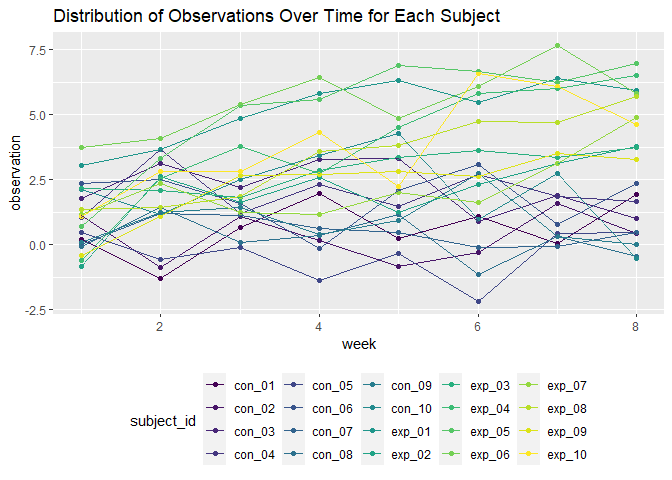

p8105\_hw5\_yo2336
================
Yoo Rim Oh

# Problem 1 done during Office Hour

## Load and clean data

``` r
homicide_df = 
  read_csv("./data/homicide-data.csv", na = c("", "Unknown")) %>%
  mutate(city_state = str_c(city, state),
         resolution = case_when(
           disposition == "Closed without arrest" ~ "unsolved",
           disposition == "Open/No arrest" ~ "unsolved",
           disposition == "Closed by arrest" ~ "solved"
         )) %>%
  relocate(city_state) %>%
  filter(city_state != "TulsaAL")
```

    ## Rows: 52179 Columns: 12

    ## -- Column specification --------------------------------------------------------
    ## Delimiter: ","
    ## chr (8): uid, victim_last, victim_first, victim_race, victim_sex, city, stat...
    ## dbl (4): reported_date, victim_age, lat, lon

    ## 
    ## i Use `spec()` to retrieve the full column specification for this data.
    ## i Specify the column types or set `show_col_types = FALSE` to quiet this message.

## Baltimore

``` r
baltimore_df =
  homicide_df %>% 
  filter(city_state == "BaltimoreMD")

baltimore_summary =
  baltimore_df %>%
  summarize(
    unsolved = sum(resolution == "unsolved"),
    n = n()
  )

baltimore_test = 
  prop.test(x = baltimore_summary %>% pull(unsolved),
            n = baltimore_summary %>% pull(n))

baltimore_test %>%
  broom::tidy()
```

    ## # A tibble: 1 x 8
    ##   estimate statistic  p.value parameter conf.low conf.high method    alternative
    ##      <dbl>     <dbl>    <dbl>     <int>    <dbl>     <dbl> <chr>     <chr>      
    ## 1    0.646      239. 6.46e-54         1    0.628     0.663 1-sample~ two.sided

## Across all Cities

``` r
prop_test_function = function(city_df) {
  
  city_summary =
    city_df %>%
    summarize(
      unsolved = sum(resolution == "unsolved"),
      n = n()
    )
  
  city_test = 
    prop.test(x = city_summary %>% pull(unsolved),
             n = city_summary %>% pull(n))

  return(city_test)
  
}

prop_test_function(baltimore_df)
```

    ## 
    ##  1-sample proportions test with continuity correction
    ## 
    ## data:  city_summary %>% pull(unsolved) out of city_summary %>% pull(n), null probability 0.5
    ## X-squared = 239.01, df = 1, p-value < 2.2e-16
    ## alternative hypothesis: true p is not equal to 0.5
    ## 95 percent confidence interval:
    ##  0.6275625 0.6631599
    ## sample estimates:
    ##         p 
    ## 0.6455607

``` r
homicide_df %>%
  filter(city_state == "AlbuquerqueNM") %>%
  prop_test_function()
```

    ## 
    ##  1-sample proportions test with continuity correction
    ## 
    ## data:  city_summary %>% pull(unsolved) out of city_summary %>% pull(n), null probability 0.5
    ## X-squared = 19.114, df = 1, p-value = 1.232e-05
    ## alternative hypothesis: true p is not equal to 0.5
    ## 95 percent confidence interval:
    ##  0.3372604 0.4375766
    ## sample estimates:
    ##         p 
    ## 0.3862434

``` r
results_df =
  homicide_df %>%
  nest(data = uid:resolution) %>%
  mutate(
    test_results = map(data, prop_test_function),
    tidy_results = map(test_results, broom::tidy)
  ) %>%
  select(city_state, tidy_results) %>%
  unnest(tidy_results) %>%
  select(city_state, estimate, starts_with("conf"))
```

## Plot

``` r
results_df %>%
  mutate(city_state = fct_reorder(city_state, estimate)) %>%
  ggplot(aes(x = city_state, y = estimate)) +
  geom_point() +
  geom_errorbar(aes(ymin = conf.low, ymax = conf.high)) +
  theme(axis.text.x = element_text(angle = 90, vjust = 0.5, hjust = 1))
```

<!-- -->

# Problem 2

## Iterate loading data and make data frame

Created a data frame named `csv_file` with the csv file names. Then
created another data frame named `file_data` with the data inside each
csv files read by using `read_csv` within `map()` to iterate for all
files. To combine the read data and create a data frame, use
`bind_cols()`. In order to match the file names and the data included,
use `bind_cols()` again and bind the 2 data frames created, `csv_file`
with names and `file_data` with corresponding data. Tidying this newly
created data frame called `study_data` involved reorganizing the `week`
variables using `pivot_longer()` to assign time variable `week` and all
the respective observation values to new variable `observation`. Then
created another variable `arm` for control vs experimental and renamed
the `files` from original `csv_file` to `subject_id` with all
participants’ unique subject id including arm and number assigned. As a
result, the new `study_df` has 4 variables with variable names
`subject_id`, `arm`, `week`, `observation` and total of 160
observations.

``` r
csv_file = 
  tibble(
  files = list.files("./data/long_study/"))

file_data =
  csv_file %>%
  map(~ read_csv(file.path("./data/long_study/", .))) %>%
  bind_cols()
```

    ## Rows: 20 Columns: 8

    ## -- Column specification --------------------------------------------------------
    ## Delimiter: ","
    ## dbl (8): week_1, week_2, week_3, week_4, week_5, week_6, week_7, week_8

    ## 
    ## i Use `spec()` to retrieve the full column specification for this data.
    ## i Specify the column types or set `show_col_types = FALSE` to quiet this message.

``` r
study_df = 
  bind_cols(csv_file, file_data) %>%
  pivot_longer(
    week_1:week_8,
    names_to = "week",
    values_to = "observation"
  ) %>%
   rename(subject_id = files) %>%
   mutate(subject_id = str_replace(subject_id, ".csv", ""),
          arm = case_when(str_detect(subject_id, "^con") ~ "control",
                          str_detect(subject_id, "^exp") ~ "experimental"),
          week = str_replace(week, "week_", ""),
          week = as.numeric(week)) %>%
   relocate(subject_id, arm)
```

## Plot

Created a spaghetti plot using `ggplot()` + `geom_point()` +
`geom_line()` combination. Assigned `week` variable as x-axis to observe
data over time and `observation` as y-axis. Color coded unique
`subject_id` and with the viridis color theme, control groups are
generally displayed in darker color scheme while experimental groups
have lighter color.

``` r
study_df %>%
ggplot(aes(x = week, y = observation, color = subject_id)) +
  geom_point() +
  geom_line() +
  labs(title = "Distribution of Observations Over Time for Each Subject")
```

<!-- -->

Control groups generally have lower observation values as compared to
the experimental group.

# Problem 3

## Load data

As provided.

``` r
set.seed(10)

iris_with_missing = iris %>% 
  map_df(~replace(.x, sample(1:150, 20), NA)) %>%
  mutate(Species = as.character(Species))
```

## Function to replace NA

Created a function called `fill_in_missing()`. With a vector input
inside the function created, `if (is.numeric(vector))` will check if the
vector input is in a numeric form and if true, replace any missing
values with a mean of vector input excluding the missing value and
create a replaced vector `new_vector`. Similarly,
`if (is.character(vector))` will check if the vector input is in a
character form and if true, replace any missing values with `virginica`
and create a replaced vector `new_vector`. The function itself will
return this `new_vector` as output.

``` r
fill_in_missing = function(vector) {
 
  
   if (is.numeric(vector)) {
     new_vector = replace_na(vector, mean(vector, na.rm = TRUE))
  }
  
  
   if (is.character(vector)) {
     new_vector = replace_na(vector, "virginica")
  }
  
  return(new_vector)
}
```

## Final dataframe with NA’s replaced and check

Used `map()` to repeat the `fill_in_missing` function process throughout
the entire data frame `iris_with_missing`. Used `bind_cols` to combine
the the new vectors from function to create a new data frame and named
it `iris_filled`. In order to check that the function successfully
replaced the missing values, used `summary(is.na())` for both data
frames before and after iteration process to ask for the existence of
NA’s. As a result, while `iris_with_missing` had 20 missing values for
each 5 variables (categorized as TRUE), the new `iris_filled` does not
have any NA (all 150 observations from each variables categorized as
FALSE).

``` r
iris_filled =
  bind_cols(
    map(iris_with_missing, fill_in_missing))


summary(is.na(iris_with_missing))
```

    ##  Sepal.Length    Sepal.Width     Petal.Length    Petal.Width    
    ##  Mode :logical   Mode :logical   Mode :logical   Mode :logical  
    ##  FALSE:130       FALSE:130       FALSE:130       FALSE:130      
    ##  TRUE :20        TRUE :20        TRUE :20        TRUE :20       
    ##   Species       
    ##  Mode :logical  
    ##  FALSE:130      
    ##  TRUE :20

``` r
summary(is.na(iris_filled))
```

    ##  Sepal.Length    Sepal.Width     Petal.Length    Petal.Width    
    ##  Mode :logical   Mode :logical   Mode :logical   Mode :logical  
    ##  FALSE:150       FALSE:150       FALSE:150       FALSE:150      
    ##   Species       
    ##  Mode :logical  
    ##  FALSE:150
